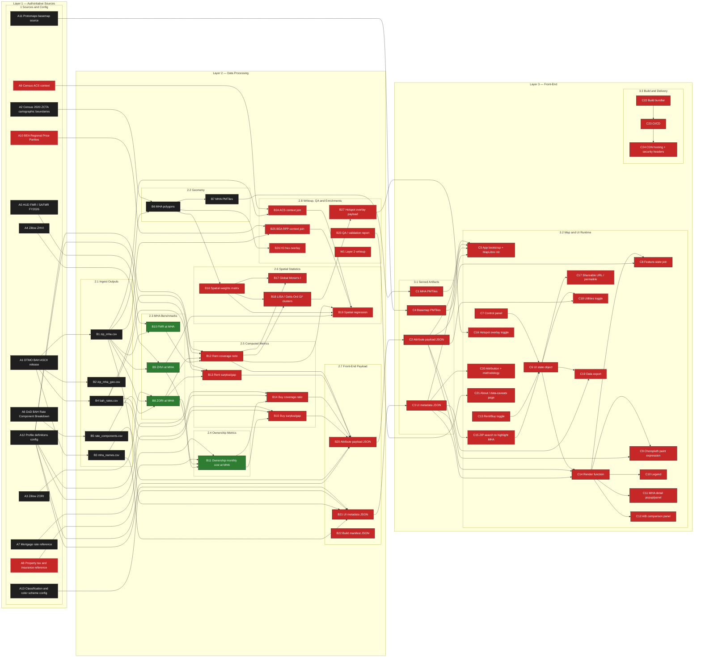

# BAH Atlas — Work Breakdown Structure

<!-- GENERATED FILE. Edit docs/wbs/nodes.csv or docs/wbs/milestones.csv, then run `make wbs`. -->

**Status as of:** 10 October 2026  
**Nodes tracked:** 65  ·  ⚫ Complete (before this week): 17  ·  🟢 Completed this week: 4  ·  🟣 In progress: 0  ·  🔴 Not started: 44

This page is the live project tracker. It is regenerated from [`docs/wbs/nodes.csv`](wbs/nodes.csv) every time progress changes, so the commit history of that file is the project's change log. Narrative updates (what was done, what is next, setbacks and changes) are in the [weekly progress log](#weekly-progress-log).

## Milestones

Progress counts **required** nodes only; optional nodes are tracked but do not gate a milestone.

| Milestone | Due | Required complete | Progress | Status |
|---|---|---|---|---|
| **M1** Layer 1 Sources + 2.1 Ingest Outputs | Sat 26 Sep | 15 / 15 | `██████████ 100%` | ✅ Complete |
| **M2** 2.2 Geometry | Sat 03 Oct | 2 / 2 | `██████████ 100%` | ✅ Complete |
| **M3** 2.3 MHA Benchmarks + 2.4 Ownership Metrics | Sat 10 Oct | 4 / 4 | `██████████ 100%` | ✅ Complete |
| **M4** 2.5 Computed Metrics | Sat 17 Oct | 0 / 4 | `░░░░░░░░░░ 0%` | ⏳ Due in 7 days |
| **M5** 2.6 Spatial Statistics | Sat 24 Oct | 0 / 3 | `░░░░░░░░░░ 0%` | 🗓️ Upcoming |
| **M6** 2.7 Front-End Payload + 2.8 Writeup | Fri 30 Oct | 0 / 5 | `░░░░░░░░░░ 0%` | 🗓️ Upcoming |
| **M7** Layer 3 Front-End | Mon 16 Nov | 0 / 19 | `░░░░░░░░░░ 0%` | 🗓️ Upcoming |

## In progress now

_Nothing marked in progress._

## Nodal map

Colour key: ⚫ Complete (before this week)  ·  🟢 Completed this week  ·  🟣 In progress  ·  🔴 Not started  ·  dashed border = optional node. Arrows point from an input to the node built from it.

## Master node list

### Layer 1 — Authoritative Sources

External inputs and project-authored config. Deterministic: identical inputs, identical results.

#### Sources and Config — due 26 September 2026 (M1)

| Status | ID | Node | Type | Inputs | Notes |
|:---:|---|---|---|---|---|
| ⚫ | **A1** | DTMO BAH ASCII release (BAH-ASCII-2026.zip) | required | — |  |
| ⚫ | **A2** | Census 2020 ZCTA cartographic boundaries | required | — |  |
| ⚫ | **A3** | Zillow ZORI (rent index) ZIP-level | required | — | completed 03 Oct |
| ⚫ | **A4** | Zillow ZHVI (home value index) ZIP-level | required | — | completed 03 Oct |
| ⚫ | **A5** | HUD FMR / SAFMR FY2026 | required | — | completed 03 Oct |
| ⚫ | **A6** | DoD BAH Rate Component Breakdown | required | — | completed 03 Oct |
| ⚫ | **A7** | Mortgage rate reference (Freddie Mac PMMS) | required | — |  |
| 🔴 | **A8** | Property tax and insurance reference | optional | — |  |
| 🔴 | **A9** | Census ACS context | optional | — |  |
| 🔴 | **A10** | BEA Regional Price Parities | optional | — |  |
| ⚫ | **A11** | Protomaps basemap source (OSM) | required | — | completed 03 Oct |
| ⚫ | **A12** | Profile definitions config | required | — | completed 03 Oct |
| ⚫ | **A13** | Classification and color scheme config | required | — | completed 03 Oct |

### Layer 2 — Data Processing

The offline Python pipeline that turns Layer 1 into compact, web-ready packages.

#### 2.1 Ingest Outputs — due 26 September 2026 (M1)

| Status | ID | Node | Type | Inputs | Notes |
|:---:|---|---|---|---|---|
| ⚫ | **B1** | zip_mha.csv - ZIP to MHA crosswalk | required | A1 |  |
| ⚫ | **B2** | zip_mha_geo.csv - MHA geo metadata | required | A1 |  |
| ⚫ | **B3** | mha_names.csv - MHA display names | required | A1 |  |
| ⚫ | **B4** | bah_rates.csv - tidy BAH rates | required | A1 |  |
| ⚫ | **B5** | rate_components.csv - rent/utilities split | required | A6 | completed 03 Oct |

#### 2.2 Geometry — due 03 October 2026 (M2)

| Status | ID | Node | Type | Inputs | Notes |
|:---:|---|---|---|---|---|
| ⚫ | **B6** | MHA polygons (ZCTA dissolve) | required | A2, B1 |  |
| ⚫ | **B7** | MHA PMTiles | required | B6 | completed 03 Oct |

#### 2.3 MHA Benchmarks — due 10 October 2026 (M3)

| Status | ID | Node | Type | Inputs | Notes |
|:---:|---|---|---|---|---|
| 🟢 | **B8** | ZORI at MHA (utilities-adjusted) | required | A3, B1, B5 | completed 08 Oct |
| 🟢 | **B9** | ZHVI at MHA | required | A4, B1 | completed 08 Oct |
| 🟢 | **B10** | FMR at MHA | required | A5, B1 | completed 08 Oct |

#### 2.4 Ownership Metrics — due 10 October 2026 (M3)

| Status | ID | Node | Type | Inputs | Notes |
|:---:|---|---|---|---|---|
| 🟢 | **B11** | Ownership monthly cost at MHA | required | A7, A8, B8, B9 | A8 tax/insurance are national placeholders in config/ownership.json; B8 supplies utilities; completed 08 Oct |

#### 2.5 Computed Metrics — due 17 October 2026 (M4)

| Status | ID | Node | Type | Inputs | Notes |
|:---:|---|---|---|---|---|
| 🔴 | **B12** | Rent coverage ratio | required | A12, B4, B8, B10 |  |
| 🔴 | **B13** | Rent surplus/gap | required | A12, B4, B8 |  |
| 🔴 | **B14** | Buy coverage ratio | required | A12, B4, B11 |  |
| 🔴 | **B15** | Buy surplus/gap | required | A12, B4, B11 |  |

#### 2.6 Spatial Statistics — due 24 October 2026 (M5)

| Status | ID | Node | Type | Inputs | Notes |
|:---:|---|---|---|---|---|
| 🔴 | **B16** | Spatial weights matrix | required | B6 |  |
| 🔴 | **B17** | Global Moran's I | required | B12, B16 |  |
| 🔴 | **B18** | LISA / Getis-Ord Gi* clusters | required | B12, B16 |  |
| 🔴 | **B19** | Spatial regression | optional | B12, B16, B9, B24, B25 |  |

#### 2.7 Front-End Payload — due 30 October 2026 (M6)

| Status | ID | Node | Type | Inputs | Notes |
|:---:|---|---|---|---|---|
| 🔴 | **B20** | Attribute payload JSON (data contract) | required | B12, B13, B14, B15, B3, A12 |  |
| 🔴 | **B21** | UI metadata JSON | required | A12, A13, B1, B3 |  |
| 🔴 | **B22** | Build manifest JSON | required | — | Reads every pipeline stage |

#### 2.8 Writeup, QA and Enrichments — due 30 October 2026 (M6)

| Status | ID | Node | Type | Inputs | Notes |
|:---:|---|---|---|---|---|
| 🔴 | **B23** | QA / validation report | required | — | Samples intermediate stages |
| 🔴 | **B24** | ACS context join | optional | A9, B1 |  |
| 🔴 | **B25** | BEA RPP context join | optional | A10, B1 |  |
| 🔴 | **B26** | H3 hex overlay (future) | optional | B6 |  |
| 🔴 | **B27** | Hotspot overlay payload | optional | B18 |  |
| 🔴 | **W1** | Layer 2 writeup (how Layer 1 becomes Layer 3) | required | — | Deliverable rather than a pipeline node |

### Layer 3 — Front-End

The static MapLibre site. Visualizes Layer 2 output; performs no data manipulation.

#### 3.1 Served Artifacts — due 16 November 2026 (M7)

| Status | ID | Node | Type | Inputs | Notes |
|:---:|---|---|---|---|---|
| 🔴 | **C1** | MHA PMTiles (served) | required | B7 |  |
| 🔴 | **C2** | Attribute payload JSON (served) | required | B20 |  |
| 🔴 | **C3** | UI metadata JSON (served) | required | B21 |  |
| 🔴 | **C4** | Basemap PMTiles (served) | required | A11 |  |

#### 3.2 Map and UI Runtime — due 16 November 2026 (M7)

| Status | ID | Node | Type | Inputs | Notes |
|:---:|---|---|---|---|---|
| 🔴 | **C5** | App bootstrap + MapLibre init | required | C1, C2, C3, C4 |  |
| 🔴 | **C6** | UI state object | required | C7, C13, C15 |  |
| 🔴 | **C7** | Control panel (dropdowns) | required | — |  |
| 🔴 | **C8** | Feature-state join | required | C14, C2 |  |
| 🔴 | **C9** | Choropleth paint expression | required | C14, C3 |  |
| 🔴 | **C10** | Legend | required | C14 |  |
| 🔴 | **C11** | MHA detail popup/panel | required | C14 |  |
| 🔴 | **C12** | A/B comparison panel | required | C14 |  |
| 🔴 | **C13** | Rent/Buy toggle | required | — |  |
| 🔴 | **C14** | Render function | required | C6, C2, C3 |  |
| 🔴 | **C15** | ZIP search to highlight MHA | optional | C3 |  |
| 🔴 | **C16** | Hotspot overlay toggle | optional | B27 |  |
| 🔴 | **C17** | Shareable URL / permalink | optional | C6 |  |
| 🔴 | **C18** | Utilities toggle | optional | C6, C2 |  |
| 🔴 | **C19** | Data export (CSV of view) | optional | C6, C2 |  |
| 🔴 | **C20** | Attribution + methodology | required | C3 |  |
| 🔴 | **C21** | About / data-caveats page | required | B23 |  |

#### 3.3 Build and Delivery — due 16 November 2026 (M7)

| Status | ID | Node | Type | Inputs | Notes |
|:---:|---|---|---|---|---|
| 🔴 | **C22** | Build bundler | required | — |  |
| 🔴 | **C23** | CI/CD (GitHub Actions) | required | C22 |  |
| 🔴 | **C24** | CDN hosting + security headers | required | C23 |  |

## Weekly progress log

- [Week of 10 October 2026](progress/2026-10-10.md)
- [Week of 03 October 2026](progress/2026-10-03.md)

## Live views on GitHub

- [Milestones](https://github.com/TheWendarr/bah-atlas/milestones) and [issues](https://github.com/TheWendarr/bah-atlas/issues) mirror this table (synced one-way from `nodes.csv` with `make wbs-sync`).
- [Commit history](https://github.com/TheWendarr/bah-atlas/commits/main) for every change to code and documentation.

---

*AI-assistance disclosure: Claude (Anthropic) assisted in identifying the project's nodes and in creating this documentation and its tooling. All project decisions, data work, and status reporting are the author's.*
